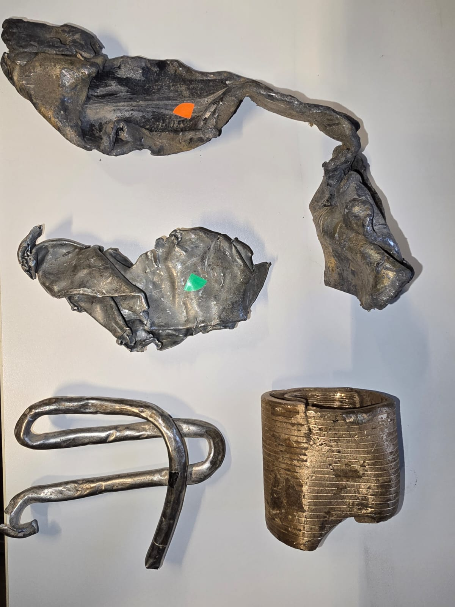

# Project Discription

Project Purpose: The project aims to automate the process of metal sorting for recycling using a vision-based detection system integrated with a robotic arm for pick-and-place tasks.

See the figure below for the system

**Image_1: (The System)**

See the figure below for the materials that need to be sorted

**Image_2: (The Materials)**

**Objectives:**
- Automate the sorting process for different types of metals.
- Increase sorting accuracy to nearly 100%.
- Improve safety by minimizing human interaction and ensuring system safeguards are in place.
- Technologies:
  - Vision System for object detection.
  - AI for metal recognition.
  - Conveyor belt for material transfer.
  - Robotic arm for picking and placing materials into designated bins.
  - Flipper to move materials of conveyor.