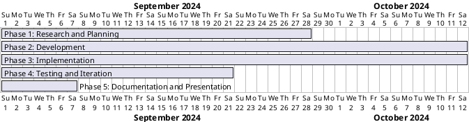
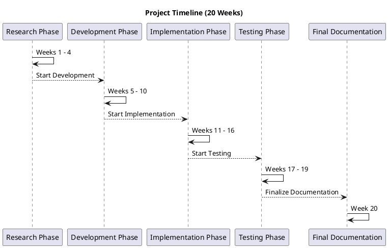

# Project Planning

```plantuml
@startgantt
Project starts 2024-09-01
[Phase 1: Research and Planning] lasts 4 weeks
[Phase 2: Development] lasts 6 weeks
[Phase 3: Implementation] lasts 6 weeks
[Phase 4: Testing and Iteration] lasts 3 weeks
[Phase 5: Documentation and Presentation] lasts 1 week
@endgantt
```

```plantuml
@startuml
title Project Timeline (20 Weeks)

participant "Research Phase" as RP
participant "Development Phase" as DP
participant "Implementation Phase" as IP
participant "Testing Phase" as TP
participant "Final Documentation" as FD

RP -> RP: Weeks 1 - 4
RP --> DP: Start Development
DP -> DP: Weeks 5 - 10
DP --> IP: Start Implementation
IP -> IP: Weeks 11 - 16
IP --> TP: Start Testing
TP -> TP: Weeks 17 - 19
TP --> FD: Finalize Documentation
FD -> FD: Week 20

@enduml
```
