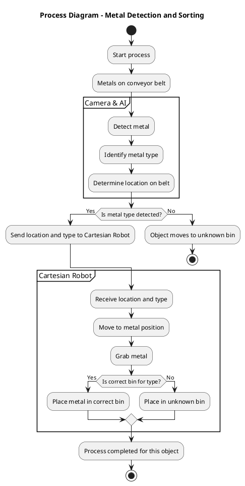

# Automation System Blueprint

This process diagram illustrates the automation setup for detecting, identifying, and sorting various types of metal on a conveyor belt. The system comprises a camera with AI capabilities and a Cartesian Robot that work together to categorize and sort metal objects.

- Detection and Identification: As metals move along the conveyor belt, a camera detects each object and, using AI, determines its type and location on the belt.

- Sorting and Placement: If a metal type is successfully identified, the information is sent to the Cartesian Robot, which moves to the specified position, picks up the object, and places it in the appropriate bin. If the metal type is unknown or not recognized, the object remains on the conveyor and is ultimately directed to an "unknown" bin.

- Continuous Operation: After each object is processed, the system resets to handle the next item on the conveyor, ensuring a continuous sorting workflow.

This diagram provides a high-level overview of the key components and steps in this automated sorting process.

