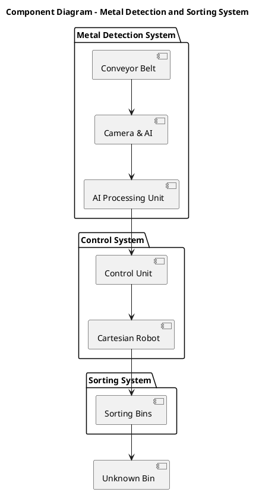

# Analysis & Design

This component diagram shows the key elements of the Metal Detection and Sorting System and their interactions.

- Metal Detection System: The Conveyor Belt moves metal objects to the Camera & AI for detection and classification.

- Control System: The AI Processing Unit analyzes the metal type, and the Control Unit directs the Cartesian Robot to sort the object.

- Sorting System: The Cartesian Robot places the metal in the correct bin or in the Unknown Bin if the type is unrecognized.
 
 
This diagram provides a structural overview of the system and how each component works together to automate the sorting process.

