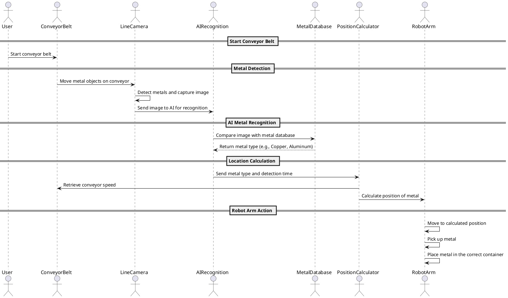

# Procces, FlowControl & Diagrams
1. Detection with line scan camera: 
The line camera continuously scans the metals on the moving conveyor belt, capturing one line of an image at a time. All these line photo's whill be put together to create an image.

2. AI recognition:
The AI analyzes these images to identify the type of metal for example copper or aluminum. The right type of metal whill be chosen by comparing the images to a data base with all the metals.

3. Location calculation and robot arm control:
The system calculates the metal’s current position based on the time elapsed and speed of the conveyer belt. The robot arm uses this calculation to pick up the object at the correct moment. The robot does this by using 3 axis one that moves above the conveyer belt in the y direction, the other ones is for the z direction to pick the metal from the belt and the last one is to rotate the gripper.

4. Sorting:
The robot arm moves each piece of metal to the appropriate location, such as a bin or container for that specific metal type.

Shown below is a diagram of how the system is used

See the figure below for the flowchart

**Image_3: (Image of Flowchart)**

See the figure below for the simplefied flowchart

**Image_3: (Image of Simplefied Flowchart)**