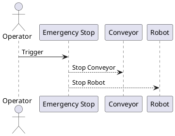

# Risk analysis
Identified Risks:

1. Mechanical Failure: Failure in the conveyor or robotic arm.
    - Mitigation: Regular maintenance schedules.
2. Vision System Errors: Inaccurate material identification due to poor lighting or sensor misalignment.
    - Mitigation: Dynamic lighting adjustments and sensor recalibration.
3. Robot Malfunctions: The robot fails to pick or sort objects.
   - Mitigation: Redundant control logic and emergency stop system.

