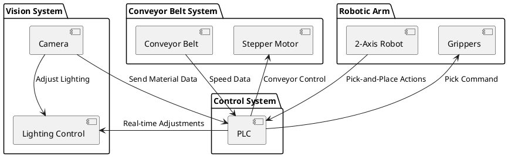

# Blueprint Diagram

**System Comunication Diagram**

1. Components using IO-Link:
  2D Cartesian robot
  Controllable lights  

2. Components using ethernet connection:
  Hyperspectral camera

3. Components using conventional IO ports on PLC:
  Start button
  Stop button
  Emergency stop
  Proximity sensor