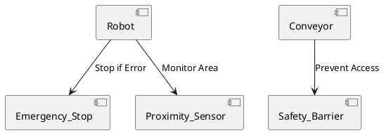

# Safety Diagrams
1. Conveyer belt:
For the conveyer belt there needs to be a safety barrier to prevent people from putting objects in between moving parts of the belt. Otherwise people could hurt them self or damage the conveyer belt.

2. Emergency stop:
For the robot there needs to be an emergency stop. This enables the user to stop the robot so they can work on the robot. And the emergency stop can stop the robot when een error occurs.

3. Proximity sensor:
By using a proximity sensor the robot can be used much safer because if a person comes to close to the robot it can stop therefore the possibility of injury is much smaller. The robot also can not go out of his working area to ensure a safer work space. 

