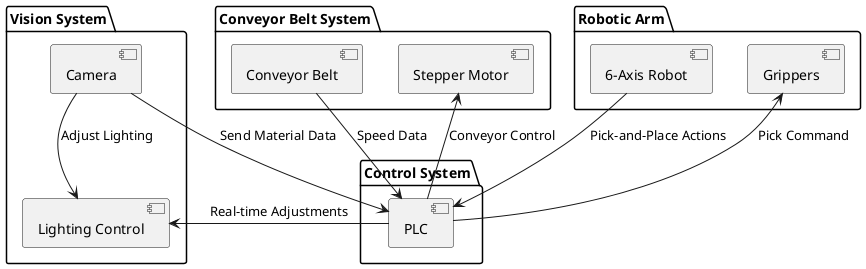

# Blueprint Diagram

```plantuml
@startuml
package "Vision System" {
  component Camera
  component "Lighting Control"
}

package "Conveyor Belt System" {
  component "Conveyor Belt"
  component "Stepper Motor"
}

package "Robotic Arm" {
  component "6-Axis Robot"
  component "Grippers"
}

package "Control System" {
  component "PLC"
}

Camera --> "Lighting Control": Adjust Lighting
Camera --> PLC: Send Material Data
"Conveyor Belt" --> PLC: Speed Data
"6-Axis Robot" --> PLC: Pick-and-Place Actions
"PLC" --> "Lighting Control": Real-time Adjustments
"PLC" --> "Stepper Motor": Conveyor Control
"PLC" --> "Grippers": Pick Command
@enduml
```
**System Comunication Diagram**