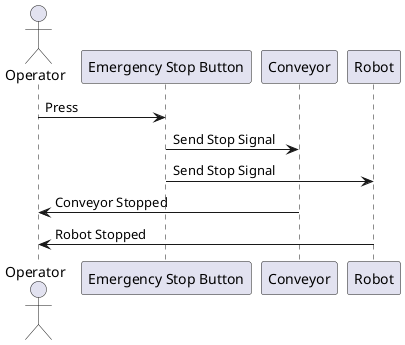

# Risk analysis

1. Technical Risks:
    - Risk: Component failures in PLC, sensors, or robot.
    - Mitigation: Regular maintenance, real-time monitoring, and backup components.

2. Sorting Accuracy Risks:
    - Risk: Inaccurate sorting due to similar metal properties.
    - Mitigation: High-resolution sensors, AI-based algorithm improvements, and periodic calibration.

3. Integration Risks:
    - Risk: Poor synchronization between conveyor and robot, leading to misplacements.
    - Mitigation: Precise control algorithms, simulation testing, and real-time feedback.

4. Environmental Risks:
    - Risk: Dust, dirt, and temperature changes affecting system performance.
    - Mitigation: Enclosures, protective covers, and adaptive lighting.

5. Software Risks:
    - Risk: Programming errors causing system malfunctions.
    - Mitigation: Rigorous testing, version control, and fail-safe protocols.

