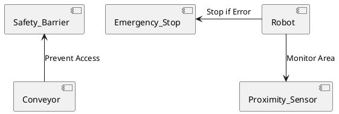

# Safety Diagrams

```plantuml
@startuml
component Robot
component Conveyor
component Emergency_Stop
component Proximity_Sensor
component Safety_Barrier

Robot -down-> Proximity_Sensor: Monitor Area
Robot -left-> Emergency_Stop: Stop if Error
Conveyor -up-> Safety_Barrier: Prevent Access
@enduml
```
**Safety Mesures**